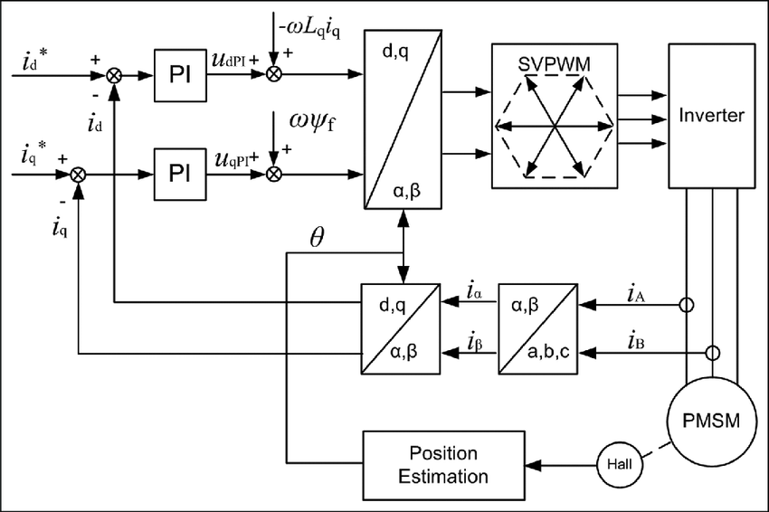
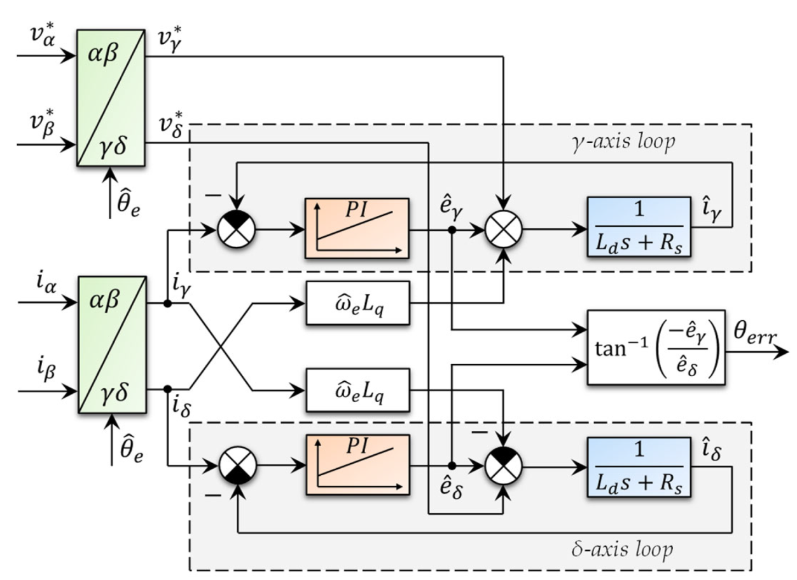
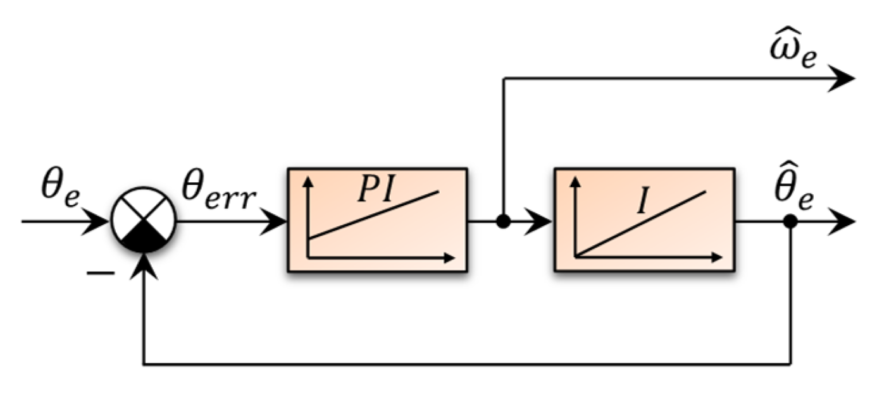

# Back EMF Observer

## Description
This project is meant to serve as a library for implementing the Back EMF observer for Permanent Magnet Synchronous Machine (PMSM) motors. This can also be used for BLDC motors they have similar dynamics with a different back EMF waveform.

### Field Oriented Control
Field Oriented Control (FOC) of PMSM machine takes advantage of Clarke and Park frame transforms to convert our AC (ABC frame) system dynamics to rotor angle independent DC (DQ frame) dynamics where the tradition PI control techniques for DC motors can work. The control variables are transformed back via inverse transform for generating voltage duties.

The knowledge of the rotor angle is important for transforming in and out of DQ and ABC frames. This is traditionally achieved by using Hall effect sensors for magnetic sensing.

<p align="center">
  
  <br>
  <em>Field Oriented Control of PMSM</em>
</p>

## Sensorless Control
In high speed applications, where Hall sensor accuracy might not be enough or they might fail due to high temperatures of the machine stator, the rotor angle can be estimated by numerically solving the system dynamics with the available state variables (currents and voltages) for the Back EMF generated by the rotor magnets. This is done by "observing" (see [State Observer](https://en.wikipedia.org/wiki/State_observer#:~:text=In%20control%20theory%2C%20a%20state,output%20of%20the%20real%20system.)) the variables used to reconstruct the lost state, which is effectively just reducing the error between the actual observed state and estimated state. This is done by tuning PI controllers to reduce estimation error in back EMFs.

<p align="center">
  
  <br>
  <em>Back EMF Observer Block Diagram</em>
</p>

The back EMFs can be used to estimate the error in the rotor angle, which is an input to another PID controller called the tracker which outputs the speed and rotor angle used for FOC.

<p align="center">
  
  <br>
  <em>Tracker</em>
</p>

## API Reference
Examples on how to use the library can be taken from the tests present in the `tests` folder.

### Dependencies
- C++ 17 compiler (GCC)
- cmake 3.15
- pre-commit
- clang-format-14

### Building the project
1. Open a shell and navigate to project root folder
2. Run the build bash script. This calls the underlying cmake command and runs tests. You can also run the build script with the `--release` or `--debug` flags.
```bash
./build.sh
```

3. Binaries are made in the bin folder. Run any executable from the bin folder.
```bash
./bin/bemf_observer_test
```
4. To clean the build and bin files, pass `--clean` flag to the build script.
```bash
./build.sh --clean
```

## References
- [Sensorless motor control using a back-EMF Sliding-Mode Observer](https://imperix.com/doc/implementation/sensorless-motor-control)
- [Extended EMF Observer](https://www.mathworks.com/help/mcb/ref/extendedemfobserver.html)
- [NXP AMCLIB User's Guide](https://www.nxp.com/docs/en/user-guide/DSP56800EAMCLIBUG.pdf)
